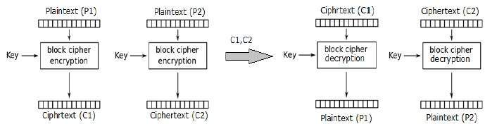
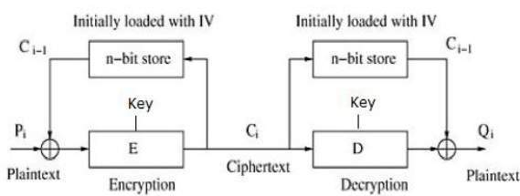
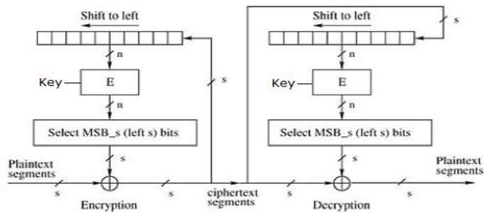
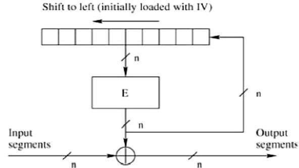
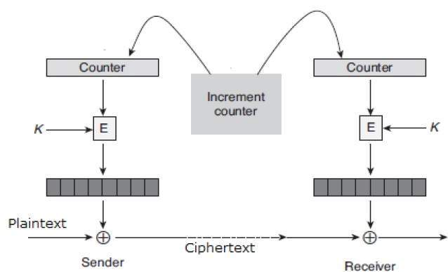

# Aulas 3 e 4
*Resumir o seguinte*

## Modos de Cifra

### Electronic Code Book (ECB)  Mode

Este modo é a forma mais direta de processar uma série de blocos de mensagens listados sequencialmente.

*Operação*
 - O utilizador pega no primeiro bloco de texto em claro e encripta-o com a chave para produzir o primeiro bloco de texto cifrado.

 - Em seguida, pega no segundo bloco de texto em claro e segue o mesmo processo com a mesma chave e assim por diante.

O modo ECB é determinístico, ou seja, se os blocos de texto em claro P1, P2,..., Pm forem encriptados duas vezes com a mesma chave, os blocos de texto cifrado resultantes serão iguais.

Na verdade, para uma determinada chave, tecnicamente podemos criar um livro de códigos com os textos cifrados para todos os possíveis blocos de texto em claro. A encriptação consistiria apenas em procurar o texto em claro necessário e selecionar o texto cifrado correspondente. Assim, a operação é análoga à atribuição de palavras-código num livro de códigos, e recebe um nome oficial - Modo de Operação em Livro de Códigos Eletrónico (ECB). É ilustrado da seguinte forma:

*Análise do Modo ECB*
Na realidade, geralmente os dados de uma aplicação contêm informações parciais que podem ser adivinhadas. Por exemplo, é possível adivinhar a faixa salarial. Um texto cifrado obtido através do modo ECB pode permitir a um atacante adivinhar o texto em claro através de tentativa e erro se a mensagem em claro for previsível.

Por exemplo, se um texto cifrado obtido através do modo ECB for conhecido por encriptar uma quantia salarial, então um pequeno número de tentativas permitirá a um atacante recuperar a quantia. Em geral, não desejamos usar um cifrador determinístico, e por isso o modo ECB não deve ser utilizado na maioria das aplicações.

### Cipher Block Chaining (CBC) Mode

O modo CBC de operação proporciona dependência da mensagem para gerar o texto cifrado e torna o sistema não determinístico.

*Operação*
A operação do modo CBC é representada na ilustração seguinte. Os passos são os seguintes:

 - Carregar o Vetor de Inicialização (IV) de n bits no registo superior.

 - Efetuar uma operação XOR entre o bloco de texto em claro de n bits e o valor de dados no registo superior.

 - Encriptar o resultado da operação XOR com o cifrador de blocos subjacente com a chave K.

 - Alimentar o bloco de texto cifrado no registo superior e continuar a operação até que todos os blocos de texto em claro sejam processados.

 - Para desencriptar, os dados do IV são efetuados um XOR com o primeiro bloco de texto cifrado desencriptado. O primeiro bloco de texto cifrado também é alimentado no registo, substituindo o IV, para desencriptar o próximo bloco de texto cifrado.

*Análise do Modo CBC*
No modo CBC, o bloco de texto em claro atual é adicionado ao bloco de texto cifrado anterior e, em seguida, o resultado é encriptado com a chave. A desencriptação é, portanto, o processo inverso, que envolve desencriptar o bloco de texto cifrado atual e depois adicionar o bloco de texto cifrado anterior ao resultado.

A *vantagem do CBC* em relação ao ECB é que a alteração do IV resulta em texto cifrado diferente para a mesma mensagem. Por outro lado, o erro na transmissão é propagado para alguns blocos seguintes durante a desencriptação devido ao efeito de encadeamento.

Vale a pena mencionar que o modo CBC serve de base para um mecanismo de autenticação de origem de dados bem conhecido. Assim, tem uma vantagem para as aplicações que requerem tanto a encriptação simétrica como a autenticação da origem dos dados.

### Cipher Feedback (CFB) Mode

Neste modo, cada bloco de texto cifrado é "retroalimentado" no processo de encriptação para encriptar o próximo bloco de texto em claro.

*Operação*
A operação do modo CFB é representada na seguinte ilustração. Por exemplo, no sistema atual, um bloco de mensagem tem um tamanho de 's' bits, onde 1 < s < n. O modo CFB requer um vetor de inicialização (IV) como o bloco de entrada aleatório inicial de n bits. O IV não precisa ser secreto. Os passos da operação são os seguintes:

 - Carregar o IV no registo superior.

 - Encriptar o valor de dados no registo superior com o cifrador de blocos subjacente com a chave K.

 - Tomar apenas 's' número de bits mais significativos (bits à esquerda) da saída do processo de encriptação e efetuar um XOR com o bloco de mensagem em claro de 's' bits para gerar o bloco de texto cifrado.

 - Alimentar o bloco de texto cifrado no registo superior, deslocando os dados já presentes para a esquerda, e continuar a operação até que todos os blocos de texto em claro sejam processados.

 - Essencialmente, o bloco de texto cifrado anterior é encriptado com a chave e, em seguida, o resultado é efetuado um XOR com o bloco de texto em claro atual.

 - Passos semelhantes são seguidos para a desencriptação. O IV pré-definido é inicialmente carregado no início da desencriptação.

*Análise do Modo CFB*
O modo CFB difere significativamente do modo ECB, uma vez que o texto cifrado correspondente a um determinado bloco de texto em claro depende não apenas desse bloco de texto em claro e da chave, mas também do bloco de texto cifrado anterior. Em outras palavras, o bloco de texto cifrado depende da mensagem.

O CFB tem uma característica muito peculiar. Neste modo, o utilizador desencripta o texto cifrado apenas usando o processo de encriptação do cifrador de blocos. O algoritmo de desencriptação do cifrador de blocos subjacente nunca é utilizado.

Aparentemente, o modo CFB converte um cifrador de blocos num tipo de cifrador em fluxo. O algoritmo de encriptação é usado como um gerador de fluxo de chaves para produzir um fluxo de chaves que é colocado no registo inferior. Este fluxo de chaves é então efetuado um XOR com o texto em claro, tal como no caso de um cifrador em fluxo.

Ao converter um cifrador de blocos num cifrador em fluxo, o modo CFB oferece algumas das propriedades vantajosas de um cifrador em fluxo, mantendo as propriedades vantajosas de um cifrador de blocos.

Por outro lado, o erro de transmissão é propagado devido à alteração dos blocos.

### Output Feedback (OFB) Mode

Envolve alimentar os sucessivos blocos de saída do cifrador de blocos subjacente de volta para o mesmo. Esses blocos de retroalimentação fornecem uma sequência de bits para alimentar o algoritmo de encriptação, que atua como o gerador de fluxo de chaves, tal como no caso do modo CFB.

O fluxo de chaves gerado é efetuado um XOR com os blocos de texto em claro. O modo OFB requer um IV como o bloco de entrada aleatório inicial de n bits. O IV não precisa ser secreto.

A operação é representada na seguinte ilustração −

### Counter (CTR) Mode

Pode ser considerado uma versão baseada em contador do modo CFB, mas sem a retroalimentação. Neste modo, tanto o remetente como o destinatário precisam de ter acesso a um contador confiável, que calcula um novo valor partilhado sempre que um bloco de texto cifrado é trocado. Este contador partilhado não necessariamente é um valor secreto, mas o desafio é que ambos os lados devem manter o contador sincronizado.

*Operação*
Tanto a encriptação como a desencriptação no modo CTR são representadas na seguinte ilustração. Os passos da operação são os seguintes:

Carregar o valor inicial do contador no registo superior, que é o mesmo tanto para o remetente como para o destinatário. Ele desempenha o mesmo papel que o IV no modo CFB (e CBC).

Encriptar o conteúdo do contador com a chave e colocar o resultado no registo inferior.

Tomar o primeiro bloco de texto em claro P1 e efetuar um XOR com o conteúdo do registo inferior. O resultado disso é C1. Enviar C1 para o destinatário e atualizar o contador. A atualização do contador substitui o feedback do texto cifrado no modo CFB.

Continuar desta forma até que o último bloco de texto em claro seja encriptado.

A desencriptação é o processo inverso. O bloco de texto cifrado é efetuado um XOR com a saída do conteúdo encriptado do valor do contador. Após a desencriptação de cada bloco de texto cifrado, o contador é atualizado, tal como na encriptação.

*Análise do Modo de Contador*
Este modo não tem dependência da mensagem e, portanto, um bloco de texto cifrado não depende dos blocos de texto em claro anteriores.

Assim como o modo CFB, o modo CTR não envolve o processo de desencriptação do cifrador de blocos. Isso ocorre porque o modo CTR realmente utiliza o cifrador de blocos para gerar um fluxo de chaves, que é encriptado usando a função XOR. Em outras palavras, o modo CTR também converte um cifrador de blocos em um cifrador em fluxo.

A grande desvantagem do modo CTR é que ele requer um contador síncrono no remetente e no destinatário. A perda de sincronização leva à recuperação incorreta do texto em claro.

No entanto, o modo CTR possui quase todas as vantagens do modo CFB. Além disso, ele não propaga nenhum erro de transmissão.

## Principio de Kerckoffs
O **princípio de Kerckoffs** é um princípio de segurança que consiste em que a chave de cifra é a única informação que deve ser mantida em segredo. Ou seja, se o algoritmo for conhecida, o atacante não deve conseguir descobrir o conteúdo da mensagem cifrada.

## Redes feistel
São funções sempre **invertíveis**, mas construídas a partir de funções que podem não ter inversa. É uma forma engenhosa de construir funções pseudoaleatórias (PRFs) e permutações pseudoaleatórias (PRPs).

A redes funciona na seguinte forma:
 - Recebe um bloco de texto-limpo;
 - Divide o bloco em duas partes (R0 e L0);
 - Aplica uma função f sobre R, aplica o xOR dela com L e obtém R1;
 - O R0 transita para L1;
 - O processo repete-se 'n' vezes;

Nota: Rackoff também refere que para uma PRP (*Pseudo random permutations*) ser segura, a rede de feistel tem de ser com **pelo menos três** rondas.

## Agente de confiança
É um agente que garante a autenticidade de uma mensagem. É um intermediário entre o emissor e o receptor da mensagem. O agente de confiança garante que a mensagem não foi alterada durante o seu transporte por um **canal seguro**.