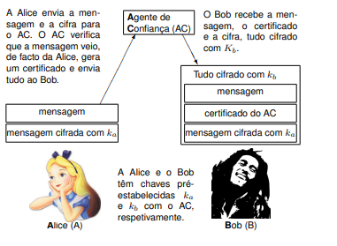

# Aula 5

## Funções Resumo Criptográfico (Hashes)

### CIA - Confidencialidade, Integridade e Disponibilidade
Estas são as propriedades que um sistema (em termos de segurança) deve ter:
 - Confidencialidade: A informação é mantida em segredo;
 - Integridade: A informação não é alterada;
 - Disponibilidade: A informação está disponível quando necessário;

### Requisitos de segurança
 - Confidencialidade (cifra);
 - Integridade (MAC - Message Authentication Code);
 - Anonimato (assinatura digital);

### Funções de Hash
Funções que dado um input de qualquer tamanho, produzem um output de um tamanho fixo. Estas funções são **one-way** (não há forma de obter o input a partir do output).

Exemplos de funções de hash:
 - MD5 (Message Digest 5) - 128 bits;

### Funções de Hash Criptográficas
Funções que dado um input de qualquer tamanho, produzem um output de um tamanho fixo. Estas funções são **one-way** (não há forma de obter o input a partir do output). São **resistentes a colisões**, ou seja, é difícil encontrar dois inputs diferentes que produzam o mesmo output (em tempo útil). Também têm como propriedade a **resistência a previsão de uma pré-imagem** e a **resistência a previsão de uma segunda pré-imagem**, ou seja, é difícil encontrar um input que produza um output conhecido.

Exemplos de funções de hash criptográficas:
 - SHA-1 (desencorajada) - Secure Hash Algorithm 160 bits;
 - SHA-256 (Secure Hash Algorithm 256 bits);
 - SHA-512 (Secure Hash Algorithm 512 bits);
 - SHA-3 (Secure Hash Algorithm 3) - permite especificar o número de bits;

## Message Authentication Code (MAC)
Há várias formas de construir um MAC, algumas delas são:
 - HMAC (Hash-based Message Authentication Code): este MAC tem dois algoritmos, um para construção e outro para verificação e recebe dois inputs, um é a chave e o outro é a mensagem;


 ## Cifra Autenticada
O conceito basea-se na implementação da combinação, de alguma forma, de cifragem e código de autenticação da mensagem. As **três formas possíveis** de combinar os dois mecanismos são:
 1. *MAC and Encrypt*: Processo de calcular o MAC da mensagem, cifrar a mensagem e concatenar o criptograma com o MAC (e.g. *SSH*);
 2. *MAC then Encrypt*: Processo de calcular o MAC da mensagem, concatená-lo à mensagem e cifrar o resultado desta operação (e.g. *TLS*);
 3. *Encrypt then MAC*: Processo de cifrar a mensagem, calcular o MAC do criptograma e concatenar os dois (e.g. *IPSec*);

Nota: A forma considerada correta é a *terceira*, já que a inclusão do MAC não degenera nunca o vazamento de informação.

## Criptografia de chave pública
A criptografia de chave pública moderna é baseada na teoria dos números e em problemas difíceis de resolver. Alguns exemplos são os protocolos de acordos de chaves, assinaturas digitais e cifras de chave pública.

Exemplos de **problemas intratáveis** com mais relevância:
 - O problema do **logaritmo discreto**;
 - O problema da **fatorização de números compostos** em números primos;

### Problema do logaritmo discreto
Consiste em encontrar o valor de um **número inteiro** (exponencial) que é utilizado para cifrar uma mensagem, conhecido o valor da base e o resultado da exponenciação, num grupo finito. Esse problema é considerado difícil de resolver computacionalmente quando se trabalha com números grandes, tornando-o fundamental para garantir a segurança da criptografia de chave pública.

Nota: A definição mais geral do problema recorre apenas a grupos cíclicos, aplicando-se, por isso a outros grupos diferentes de números primos. O melhor algoritmo conhecido para resolver o problema do logaritmo discreto é conhecido por *general number field sieve*, determinando o tamanho que o número tem de ter para que o problema seja considerado seguro.

O problema do logaritmo discreto está na base do **protocolo de acordo de chaves Diffie-Hellman e da cifra RSA**.

### Problema da fatorização de números compostos
Consiste em decompor um número composto nos seus **fatores primos**. Por exemplo, se tivermos o número 15, ele pode ser decomposto em 3 e 5, que são números primos. O problema da fatorização torna-se difícil à medida que os números tornam-se maiores, e isso é utilizado em **esquemas de criptografia de chave pública** baseados em algoritmos como o **RSA**. A segurança desses esquemas depende do fato de que a fatorização de números grandes em fatores primos é **computacionalmente difícil** de ser realizada em tempo razoável, tornando a criptografia de chave pública segura contra ataques de criptoanálise.

## Protocolos de acordos de chaves
Neste capítulo é apresentado formas de trocar ou estabelecer um segredo entre duas entidades sem haver nada **secreto** acordado à partida. Essa troca é realizada por uma comunicação segura, aonde as partes enviam mensagens encriptadas uma para a outra e usam técnicas de criptografia e matemática para garantir que apenas elas possam obter a chave secreta compartilhada. O objetivo é garantir a segurança e a privacidade das comunicações entre as partes envolvidas.

Nota: Este tipo de protocolo deve ser utilizado em situações de **ataque ao homem no meio passivo**, onde o atacante não consegue modificar as mensagens que são enviadas entre as partes.

## Protocolo de Diffie-Hellman
Aquele que é talvez o protocolo mais conhecido da criptografia moderna é o *protocolo de acordo de chaves Diffie-Hellman*. Este protocolo é usado para partilhar um segredo criptográfico sem que para tal seja necessário estabelecer segredos anteriores. Este protocolo é seguro apenas no caso em que um adversário pode escutar a comunicação, mas não manipulá-la. A sua segurança é baseada no problema do *logaritmo discreto*.

```
Step 1: Alice and Bob get public numbers P = 23, G = 9

Step 2: Alice selected a private key a = 4 and
        Bob selected a private key b = 3

Step 3: Alice and Bob compute public values
Alice:    x =(9^4 mod 23) = (6561 mod 23) = 6
        Bob:    y = (9^3 mod 23) = (729 mod 23)  = 16

Step 4: Alice and Bob exchange public numbers

Step 5: Alice receives public key y =16 and
        Bob receives public key x = 6

Step 6: Alice and Bob compute symmetric keys
        Alice:  ka = y^a mod p = 65536 mod 23 = 9
        Bob:    kb = x^b mod p = 216 mod 23 = 9

Step 7: 9 is the shared secret.
```

## Puzzles de Merkle
O primeiro protocolo estudado é conhecido por Puzzles de Merkle e elabora em problemas que podem ser
resolvidos com algum esforço pela Alice e pelo Bob, mas que requerem muito mais esforço por parte da Claire. O protocolo usa apenas mecanismos da criptografia de chave simétrica, nomeadamente uma cifra de chave simétrica semanticamente segura E(k, m), e.g., com k ∈ {0, 1} 128. O protocolo funciona como se mostra a seguir.

Temos um cenário típico em que Alice e Bob querem compartilhar uma chave secreta comum usando uma linha insegura. Os quebra-cabeças de Merkle propõem o seguinte protocolo.

```
 - Alice gera N segredos com N índices e insere cada par [segredo, índice] em um quebra-cabeça que pode ser resolvido em tempo Θ(N)

 - Alice envia todos os quebra-cabeças para Bob

 - Bob escolhe aleatoriamente um quebra-cabeça e obtém um par [segredo, índice] resolvendo o quebra-cabeça

 - Bob envia o índice de volta para Alice

 - com base no índice, ambos compartilham um segredo comum, agora
o adversário conhece todos os quebra-cabeças de Alice e o índice de Bob; 

 - para encontrar o segredo, ela tem que resolver N quebra-cabeças para comparar os índices, o que requer tempo Θ(N²)
```

## Cifras de chave pública
Usam problema de matemática intratáveis para gerar chaves. São baseadas em problemas de logaritmo discretos e fatorização de números compostos.

Exemplo:
São gerados dois números primos, X e Y (de tamanho de 512 bits) e geram o primo Z, sendo Z resultado da multiplicação de X e Y. O número Z é conhecido como **módulo** e é usado para gerar as chaves pública e privada.

## RSA
Um cifra de **chave pública** que precisa de:

 - Gerador de chaves: Primeiramente geramos dois números primos extremamente grandes, **X** e **Y**. Calcula-mos **Z** que é o produto de X e Y. Calcular números *phi* de Z, que é o produto de X-1 e Y-1. 
 
 - Finalmente, arranjamos dois números que multiplicados preencham esta condição: **((E * D) mod phi(Z)) = 1**. O número E é a chave pública e o D é a chave privada;

 - Um algoritmo para cifrar: Para cifrar fazemos a seguinte operação: C = M^E mod Z, sendo o M a mensagem a cifrar e C a mensagem cifrada;

 - Um algoritmo para decifrar: Para decifrar fazemos a seguinte operação: M = C^D mod Z, sendo o C a mensagem cifrada e M a mensagem decifrada.


Nota: Normalmente não se utiliza o **Text Book RSA** (apenas cifrar o conteúdo pretendido). Invés disso é acrescentado um *padding* aleatório para aumentar a segurança (OAEP ou Optimal Assimetric Encription Padding).

## Esquema de assinatura digital
Recorrendo a chaves públicas (nomeadamente RSA), são usados três algoritmos:
 - Algoritmo para gerar chaves: É gerado um par de chaves, uma pública e outra privada;
   - (pub, priv) = RSA(512);
 - Algoritmo para gerar assinatura: É calculado o Hash da mensagem e decifrado com a chave privada;
   - t = RSA(priv, SHA256(m));
 - Algoritmo para verificar assinatura: É calculado o Hash da mensagem e decifrado com a chave pública;
   - v = RSA(pub, SHA256(m)) == t;

Nota: É possivel fazer um esquema de assinatura digital com chaves simétricas, porém seria necessário um agentes de confiança para garantir a integridade da chave.

### Propriedades principais de uma assinatura digital
Estas são as **cinco principais propriedades** de uma assinatura digital:
  - **Autenticidade**: A mensagem foi assinada pelo dono da chave privada;
  - *Autenticação da origem de informação**: A assinatura digital é única para cada mensagem;
  - **Integridade dos dados**: Qualquer alteração na mensagem invalida a assinatura;
  - **Dificuldade de falsificação**: É difícil falsificar uma assinatura digital;
  - **Garantia de não repúdio**: O dono da chave privada não pode negar que assinou a mensagem.

Nota: A criptografia de chave pública é possível graças a dois tipos básicos de funções:
 - **Funções de sentido único** (one way fuctions) com
propriedades homomórficas;
 - **Funções de sentido único** com propriedades homomórficas com **alçapão**.

No caso da *assinatura digital (e dos MAC)*, **o modelo de ataque é chamado de forja existencial**. Neste modelo, assume-se que o atacante tem acesso a várias mensagens assinadas e vai tentar obter uma outra com uma assinatura válida (vai falsificar uma assinatura).

## Implementação usando Criptografia de Chave Simétrica
Note-se que apesar dos algoritmos da criptografia de chave pública serem particularmente vocacionados para construção de esquemas de assinatura digital, **é possível construir uma assinatura digital segura usando apenas mecanismos da criptografia de chave simétrica**, embora tenha de existir um **Agente de Confiança(AC)** envolvido, conforme se mostra a seguir:




```

 - 1. A Alice cifra a mensagem m com a chave simétrica
pré-estabelecida com o AC.

 - 2. A Alice envia a mensagem e a sua cifra ao AC.

 - 3. O AC decifra c1 e verifica se veio mesmo da Alice, comparando-o com a mensagem m. Caso sejam iguais, elabora um certificado, que concatena com a mensagem e com a cifra recebida da Alice.

 - 4. O AC envia tudo cifrado para o Bob.

 - 5. Bob obtém a mensagem original m, bem como a cifra original da Alice c1 e um certificado que garante que foi a Alice quem assinou.
```

A verificação da assinatura é inerente ao sistema
usado na comunicação:
```
 - 1. O Bob confia no AC e aceita o certificado que este lhe manda;

 - 2. A assinatura é autêntica, porque o AC assegura ao Bob que foi a Alice que assinou a mensagem;

 - 3. A assinatura não pode ser forjada porque só a Alice e o AC é que conhecem Ka (o Bob nunca chega a precisar desta chave).

 - 4. A assinatura não pode ser usada posteriormente, porque o Bob nunca conseguiria gerar outra mensagem e cifrá-la com ka.

 - 5. A mensagem não pode ser alterada por causa da mesma razão.

 - 6. A Alice nunca pode dizer que não foi ela quem enviou a mensagem, porque o Bob tem a mensagem que ela mandou para o AC, cifrada com a chave secreta partilhada entre a Alice e o AC.
 
```

## Criptograma do ElGamal
São necessários três algoritmos:
 - **Gerar chaves** públicas e privadas:
   - Gera um número P (número primo grande) e um número G (gerador);
   - Gera um x entre 1 e P;
   - Calcula X = G^x mod P;
   - A chave pública é (X, G, P);
 - Para **cifrar**:
   - Necessita da chave pública, do texto-limpo e de um número aleatório A entre 1 e P;
   - Calcula Y = G^A mod P;
   - Calcula K = X^A mod P;
   - Calcula o texto cifrado C = (m * K) mod P;
   - Envia o texto cifrado C e o Y;  
 - Para **decifrar**:
   - Recebe o texto cifrado C e o Y;
   - Calcula o K = Y^x mod P;
   - Calcula a mensagem m = (C * K^-1) mod P; 

Nota: neste criptograma caso eu cifre a mensagem duas vezes, irá resultar de dois textos cifrados diferentes.