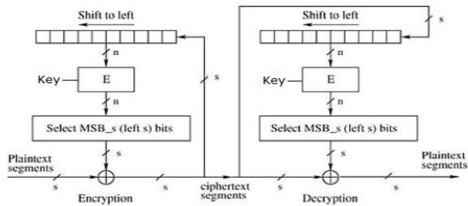
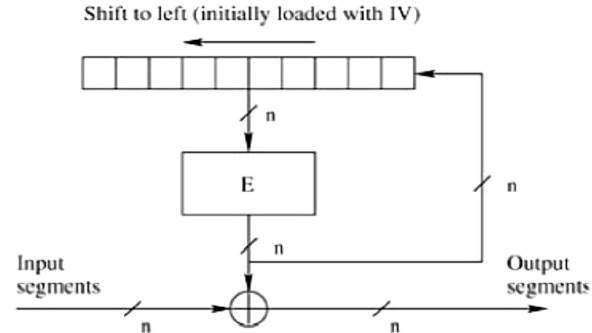
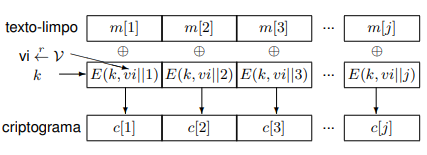
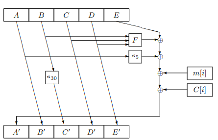

# Segurança Informática

### Aulas
 #### 20/03/2024 - So Far:
      * Definições relacionadas com criptografia
      * Criptografia clássica (Novo algoritmo)
      * Modelos de ataque
      * Propriedades de cifras modernas
      * Cifras de chave simétrica contínuas
      * Cifras de chave simétrica por blocos

## Conceitos e terminologias

### Criptografia moderna

1. **Texto-limpo**: mensagem original.
2. **Cifra ou Esquema Criptográfico**: algoritmo que transforma o texto-limpo em texto-cifrado e vice-versa (por norma são dois algoritmos diferentes).
3. **Criptograma**: texto-cifrado.
4. **Chave de cifra**: conjunto de dados que permite a cifrar e/ou decifrar do texto-limpo.
5. **Sistema criptográfico**: conjunto de cifra, chave de cifra, conjunto de decifra e chave de decifra.
6. **Modelo de ataque**: classificação para um possível ataque ao sistema criptográfico.
7. **Ataque**: Tentativa de quebra dos objetivos da técnica criptográfica.

### Segurança em Redes

1. **Firewall**: dispositivo que controla o tráfego de dados definindo regras de acesso e filtragem de pacotes.
2. **Hacker**: pessoa que tem conhecimentos técnicos e que utiliza esses conhecimentos para explorar falhas de segurança.
3. **White hat**: hacker que utiliza os seus conhecimentos para melhorar a segurança de sistemas.
4. **Grey hat**: hacker que consegue encontrar vulnearbilidades de segurança e que as explora sem fins maliciosos.
5. **Black hat**: hacker que utiliza os seus conhecimentos para explorar falhas de segurança.
6. **Script kiddie**: não tem conhecimentos técnicos, mas utiliza ferramentas de hackers para explorar falhas de segurança para fins maliciosos.
7. **Sistema de deteção de intrusão** (*IDS*): conjunto de ferramentas que monitorizam a rede e alertam sobre possíveis ataques (e.g. *Windows Defender*).
8. **Sistema de deteção e prevenção de intrusão** (*IPS*): conjunto de ferramentas que monitorizam a rede e bloqueiam ataques (e.g. *Windows Firewall*).
9. **Vulnerabilidade**: característica do sistema que o torna
vulnerável a determinados ataques.
1. **Exploit**: conjunto de instruções que exploram uma vulnerabilidade.
2.  **Ataque de negação de serviço** (*DoS*): ataque que visa saturar o sistema de forma a torná-lo indisponível.
3.  **Defesa**: conjunto de medidas que visam proteger o sistema de ataques.
4.  **Política de segurança**: Documento que define as ameaças, os recursos críticos e as vulnerabilidades, a quantificação do risco e a concretização dos objetivos de segurança para determinada organização ou entidade.
5.  **Vírus**: programa que se propaga e se dissemina sozinho pela rede, com a ajuda da execução de um programa hospedeiro.
6.  **Worm**: programa que se propaga e se dissemina sozinho pela rede (Ao contrário do vírus não precisa de um programa hospedeiro).
7.  **Cavalo de troia**: São um tipo de *malware* que se disfarça de um programa legítimo, mas que na verdade executa um código malicioso.

## Criptografia, Criptanálise, Definição de Cifra e Modelos de Ataque

### Criptografia
Conjunto de técnicas que procuram tornar possivel a comunicação secreta entre 2 agentes sobre um canal aberto. É constituído por cifras, mecanismos de integridade e de troca de chaves ou segredos criptográficos.

### Criptanálise
É o estudo de técnicas que visam gorar os objetivos da Criptografia, isto é, quebrar a segurança da comunicação.

### Criptologia
Conjuntamente, a Criptografia e a Criptanálise formam uma disciplina a que podemos chamar Criptologia. é uma área com profundas raízes na Matemática e nas Ciências da Computação.

## Cifras
A cifra constitui um dos mecanismos mais importantes da criptografia. É possível definir cifras de chave-simétrica e cifras de chave-pública, bem como dividir as primeiras em cifras de chave-simétrica contínuas ou por blocos.

### Propriedades necessárias de cifras seguras
Estas são algumas das propriedades que uma cifra segura tem:
- **Difusão**: Se uma cifra for de qualidade, quaisquer propriedades estatísticas do texto limpo estão completamente **difusas** (sem qualquer tipo de correlação) por todo o criptograma.
- **Confusão**: Se uma cifra for de qualidade, não são perceptiveis quaisquer relações entre um bloco de texto-limpo, a chave de cifra e o bloco de criptograma.
- **Não maneável**: Se uma cifra for de qualidade, não é possível **manejar** (alterar) o texto cifrado sem que o texto limpo seja alterado. Esta propriedade é mantida por um código de **autenticação de mensagem**.
- **Semântica**: Se uma cifra for de qualidade, o adversário não deverá ser capaz de obter informações sobre o texto limpo a partir do texto cifrado.
- **Não determinística**: Esta propriedade permite que a cifra produza saídas diferentes para o mesmo texto limpo e chave de cifra.

Nota: Todas estas propriedades acima têm que ser balenceadas com a **usabilidade** da cifra.

### Cifras clássicas
São algoritmos que utilizam a mesma chave para cifrar e decifrar. Cifras clássicas têm **um** algoritmo (para cifrar e para decifrar).

Alguns Exemplos:
 - Cifra de César;
 - Cifra de Vigenère (mais difusa que a de César);
 - Cifra Enigma;
 - Cifra de Vernam (perfeita em termos de secretismo, contudo não é usável);

### Cifras de chave simétrica
Um par de algoritmos eficientes que usam a mesma chave para ambas as operações. O algoritmo (ou operação) de cifra é normalmente dotada de aleatoriedade, enquanto que a decifra é determinística.

#### Cifras de chave simétrica continuas
As cifras de chave simétrica continuas usam um algoritmo que a partir de uma chave com tamanho **fixo** e **comportável**, geral uma sequência tão grande quanto necessária para cifrar um ficheiro. Cifras de chave simétrica continua têm **três** algoritmos (para cifrar, para decifrar e para gerar chaves).

Nota: Este tipo de cifra tem como defeito a sua **maneabilidade** (facilidade da alteração do texto cifrado). Se cifrarmos um ficheiro já antes cifrado com a **mesma chave**, iremos obter o texto-limpo.

#### RC4 (Rivest Cipher 4)
É um algoritmo de cifra simétrica que utiliza uma chave de 40 a 2048 bits.

#### Cifras de chave simétrica por blocos
A diferença entre as cifras de chave simétrica de bloco e as cifras de chave simétrica continua é que as cifras de chave simétrica de bloco geram uma cifra de tamanho fixo (bloco) e não uma cifra de tamanho variável. Caso a cifra de chave simétrica de bloco seja alterada (maneada), o texto cifrado perderá toda a sua integridade.

### *Padding* (Preenchimento)
O **padding** é uma técnica de preenchimento de dados que consiste em adicionar um número de bytes ao final de um bloco de dados, de forma a que o tamanho do bloco de dados seja múltiplo do tamanho do bloco de dados da cifra.

Nota: O último bloco tem sempre *padding*, mesmo que o bloco da mensagem seja múltiplo do tamanho do bloco da cifra é acrescentado um bloco de *padding*.

Nota: Este tipo de cifra é mais segura, dependendo de como são usadas, quando o canal de comunicação permite a **alteração** da mensagem cifrada.

## Algoritmos conhecidos

### AES (Advanced Encryption Standard)
É um algoritmo de cifra simétrica por blocos que utiliza uma chave de 128, 256 OU 512 bits. Ele é bastante usado para criptografar dados em trânsito na internet.

### DES (Data Encryption Standard)
É (era!?) um das cifras de chave simétrica por blocos mais importantes. Estabeleceu o precedente em meados de 1970 como a primeira cifra de nível comercial com uma completa e aberta especificação dos detalhes de implementação.

### Definição de Cifra de Chave-Pública (Assimétrica)
Um cifra de chave pública é constituída por um conjunto de algoritmos eficientes (G, E, D) em que um conjunto de chaves (pK, sK) são usados para cifrar e decifrar e outro gera essas mesmas chaves.

## Algoritmos conhecidos

### RSA (Rivest, Shamir, Adleman)
É um algoritmo de cifra pública que utiliza uma chave de 512 a 4096 bits. Ele é bastante usado para criptografar dados em trânsito na internet.

Nota: RSA no modo livre de escola é **determinístico**.

## Tipos de ataques
Alguns exemplos dos tipos de ataques mais comuns:

### Ataque força bruta (Brute force)
É uma técnica de ataque que consiste em tentar todas as possíveis chaves de cifra até encontrar a chave correta.

### Ataque com conhecimento de texto-limpo original (Known plaintext attack)
É uma técnica de ataque que consiste em tentar descobrir a chave de cifra a partir de um texto-limpo original e do texto-cifrado correspondente.

### Ataque com conhecimento do criptograma original (Cyphertext Only Attack)
ataque que consiste em tentar descobrir a chave de cifra ou o texto-limpo, a partir de um texto-cifrado.

### Ataque com o texto-limpo original escolhido pelo atacante (Chosen plaintext attack)
É uma técnica de ataque que consiste em tentar descobrir a chave de cifra ou o texto-limpo a partir de um texto-limpo original escolhido pelo atacante.

### Ataque com o texto-limpo original escolhido pelo ataque adaptativo (Adaptative Chosen plaintext attack)
Semelhante ao anterior, porém o atacante obtém exemplos de texto cifrado antes e depois de começar o ataque.

### Ataques com criptogramas escolhidos pelo atacante (Chosen ciphertext attack)
É uma técnica de ataque que consiste em tentar descobrir a chave de cifra ou o texto-limpo a partir de um conjunto de textos-cifrados escolhidos pelo atacante, diferentes do texto que queremos cifrar.

Nota: Não é uma técnica de criptanálise.

### Ataque do homem no meio
Este tipo de ataque é feito quando a **Pessoa A (Alice)** e a **Pessoa B (Bob)** estão sujeitos a um ataque por uma **Pessoa C (Claire)** que se encontra no meio da comunicação entre as duas pessoas. Existem dois tipos de ataque do homem no meio:
- **Ataque do homem no meio passivo**: A **Pessoa C (Claire)** não consegue alterar (apenas vê) a mensagem cifrada (também chamada de **Pessoa E (Eve)**).
- **Ataque do homem no meio ativo**: A **Pessoa C (Claire)** consegue alterar e ver a mensagem cifrada.

## Modos de Cifra

### Electronic Code Book (ECB)  Mode

Este modo é a forma mais direta de processar uma série de blocos de mensagens listados sequencialmente.

*Operação*
 - O utilizador pega no primeiro bloco de texto em claro e encripta-o com a chave para produzir o primeiro bloco de texto cifrado.

 - Em seguida, pega no segundo bloco de texto em claro e segue o mesmo processo com a mesma chave e assim por diante.

O modo ECB é determinístico, ou seja, se os blocos de texto em claro P1, P2,..., Pm forem encriptados duas vezes com a mesma chave, os blocos de texto cifrado resultantes serão iguais.

Na verdade, para uma determinada chave, tecnicamente podemos criar um livro de códigos com os textos cifrados para todos os possíveis blocos de texto em claro. A encriptação consistiria apenas em procurar o texto em claro necessário e selecionar o texto cifrado correspondente. Assim, a operação é análoga à atribuição de palavras-código num livro de códigos, e recebe um nome oficial - Modo de Operação em Livro de Códigos Eletrónico (ECB). É ilustrado da seguinte forma:


*Análise do Modo ECB*
Na realidade, geralmente os dados de uma aplicação contêm informações parciais que podem ser adivinhadas. Por exemplo, é possível adivinhar a faixa salarial. Um texto cifrado obtido através do modo ECB pode permitir a um atacante adivinhar o texto em claro através de tentativa e erro se a mensagem em claro for previsível.

Por exemplo, se um texto cifrado obtido através do modo ECB for conhecido por cifrar uma quantia salarial, então um pequeno número de tentativas permitirá a um atacante recuperar a quantia. Em geral, não desejamos usar um cifrador determinístico, e por isso o modo ECB não deve ser utilizado na maioria das aplicações.

### Cipher Block Chaining (CBC) Mode

O modo CBC de operação proporciona dependência da mensagem para gerar o texto cifrado e torna o sistema não determinístico.

*Operação*
A operação do modo CBC é representada na ilustração seguinte. Os passos são os seguintes:

 - Carregar o Vetor de Inicialização (IV) de n bits no registo superior.

 - Efetuar uma operação XOR entre o bloco de texto em claro de n bits e o valor de dados no registo superior.

 - cifrar o resultado da operação XOR com o cifrador de blocos subjacente com a chave K.

 - Alimentar o bloco de texto cifrado no registo superior e continuar a operação até que todos os blocos de texto em claro sejam processados.

 - Para decifrar, os dados do IV são efetuados um XOR com o primeiro bloco de texto cifrado desencriptado. O primeiro bloco de texto cifrado também é alimentado no registo, substituindo o IV, para decifrar o próximo bloco de texto cifrado.


*Análise do Modo CBC*
No modo CBC, o bloco de texto em claro atual é adicionado ao bloco de texto cifrado anterior e, em seguida, o resultado é encriptado com a chave. A desencriptação é, portanto, o processo inverso, que envolve decifrar o bloco de texto cifrado atual e depois adicionar o bloco de texto cifrado anterior ao resultado.

A *vantagem do CBC* em relação ao ECB é que a alteração do IV resulta em texto cifrado diferente para a mesma mensagem. Por outro lado, o erro na transmissão é propagado para alguns blocos seguintes durante a desencriptação devido ao efeito de encadeamento.

Vale a pena mencionar que o modo CBC serve de base para um mecanismo de autenticação de origem de dados bem conhecido. Assim, tem uma vantagem para as aplicações que requerem tanto a encriptação simétrica como a autenticação da origem dos dados.

### Cipher Feedback (CFB) Mode

Neste modo, cada bloco de texto cifrado é "retroalimentado" no processo de encriptação para cifrar o próximo bloco de texto em claro.

*Operação*
A operação do modo CFB é representada na seguinte ilustração. Por exemplo, no sistema atual, um bloco de mensagem tem um tamanho de 's' bits, onde 1 < s < n. O modo CFB requer um vetor de inicialização (IV) como o bloco de entrada aleatório inicial de n bits. O IV não precisa ser secreto. Os passos da operação são os seguintes:

 - Carregar o IV no registo superior.

 - cifrar o valor de dados no registo superior com o cifrador de blocos subjacente com a chave K.

 - Tomar apenas 's' número de bits mais significativos (bits à esquerda) da saída do processo de encriptação e efetuar um XOR com o bloco de mensagem em claro de 's' bits para gerar o bloco de texto cifrado.

 - Alimentar o bloco de texto cifrado no registo superior, deslocando os dados já presentes para a esquerda, e continuar a operação até que todos os blocos de texto em claro sejam processados.

 - Essencialmente, o bloco de texto cifrado anterior é encriptado com a chave e, em seguida, o resultado é efetuado um XOR com o bloco de texto em claro atual.

 - Passos semelhantes são seguidos para a desencriptação. O IV pré-definido é inicialmente carregado no início da desencriptação.



*Análise do Modo CFB*
O modo CFB difere significativamente do modo ECB, uma vez que o texto cifrado correspondente a um determinado bloco de texto em claro depende não apenas desse bloco de texto em claro e da chave, mas também do bloco de texto cifrado anterior. Em outras palavras, o bloco de texto cifrado depende da mensagem.

O CFB tem uma característica muito peculiar. Neste modo, o utilizador desencripta o texto cifrado apenas usando o processo de encriptação do cifrador de blocos. O algoritmo de desencriptação do cifrador de blocos subjacente nunca é utilizado.

Aparentemente, o modo CFB converte um cifrador de blocos num tipo de cifrador em fluxo. O algoritmo de encriptação é usado como um gerador de fluxo de chaves para produzir um fluxo de chaves que é colocado no registo inferior. Este fluxo de chaves é então efetuado um XOR com o texto em claro, tal como no caso de um cifrador em fluxo.

Ao converter um cifrador de blocos num cifrador em fluxo, o modo CFB oferece algumas das propriedades vantajosas de um cifrador em fluxo, mantendo as propriedades vantajosas de um cifrador de blocos.

Por outro lado, o erro de transmissão é propagado devido à alteração dos blocos.

### Output Feedback (OFB) Mode

Envolve alimentar os sucessivos blocos de saída do cifrador de blocos subjacente de volta para o mesmo. Esses blocos de retroalimentação fornecem uma sequência de bits para alimentar o algoritmo de encriptação, que atua como o gerador de fluxo de chaves, tal como no caso do modo CFB.

O fluxo de chaves gerado é efetuado um XOR com os blocos de texto em claro. O modo OFB requer um IV como o bloco de entrada aleatório inicial de n bits. O IV não precisa ser secreto.

A operação é representada na seguinte ilustração −



### Counter (CTR) Mode

Pode ser considerado uma versão baseada em contador do modo CFB, mas sem a retroalimentação. Neste modo, tanto o remetente como o destinatário precisam de ter acesso a um contador confiável, que calcula um novo valor partilhado sempre que um bloco de texto cifrado é trocado. Este contador partilhado não necessariamente é um valor secreto, mas o desafio é que ambos os lados devem manter o contador sincronizado.

*Operação*
Tanto a encriptação como a desencriptação no modo CTR são representadas na seguinte ilustração. Os passos da operação são os seguintes:

Carregar o valor inicial do contador no registo superior, que é o mesmo tanto para o remetente como para o destinatário. Ele desempenha o mesmo papel que o IV no modo CFB (e CBC).

cifrar o conteúdo do contador com a chave e colocar o resultado no registo inferior.

Tomar o primeiro bloco de texto em claro P1 e efetuar um XOR com o conteúdo do registo inferior. O resultado disso é C1. Enviar C1 para o destinatário e atualizar o contador. A atualização do contador substitui o feedback do texto cifrado no modo CFB.

Continuar desta forma até que o último bloco de texto em claro seja encriptado.

A desencriptação é o processo inverso. O bloco de texto cifrado é efetuado um XOR com a saída do conteúdo encriptado do valor do contador. Após a desencriptação de cada bloco de texto cifrado, o contador é atualizado, tal como na encriptação.


*Análise do Modo de Contador*
Este modo não tem dependência da mensagem e, portanto, um bloco de texto cifrado não depende dos blocos de texto em claro anteriores.

Assim como o modo CFB, o modo CTR não envolve o processo de desencriptação do cifrador de blocos. Isso ocorre porque o modo CTR realmente utiliza o cifrador de blocos para gerar um fluxo de chaves, que é encriptado usando a função XOR. Em outras palavras, o modo CTR também converte um cifrador de blocos em um cifrador em fluxo.

A grande desvantagem do modo CTR é que ele requer um contador síncrono no remetente e no destinatário. A perda de sincronização leva à recuperação incorreta do texto em claro.

No entanto, o modo CTR possui quase todas as vantagens do modo CFB. Além disso, ele não propaga nenhum erro de transmissão.

### Deterministic Counter Mode

Na secção anterior foi demonstrado que o modo ECB não é semanticamente seguro perante o modelo de ataque mais simples de todos –COA. O problema é que dois blocos iguais são cifrados sempre da mesma forma quando se usa este modo de cifra. **É possível apresentar uma construção baseada em PRPs simples que resolve esse problema, mas que não é semanticamente segura no modelo de ataque seguinte**: o CPA, em que o atacante tem acesso a vários pares conhecidos textolimpo/criptogramas. Repare-se que isto pode acontecer facilmente na realidade, bastando para isso que um atacante esteja a escutar uma comunicação onde passem várias mensagens cifradas com a mesma chave.

O modo contador determinístico define uma cifra de
chave simétrica contínua a partir de uma cifra por
blocos, fazendo uso apenas da função de cifra E(k, .),
que é inicializada com uma chave e reincidentemente
usada para gerar blocos pseudo aleatórios, através da
cifra dos valores de um contador que começa, por exemplo, com 1. Estes blocos são depois somados módulo
2 com o texto a cifrar, conforme se mostra na figura seguinte.


Note, no modo CTR determinístico, que o algoritmo de
decifra é igual ao algoritmo de cifra (porque, no fundo,
estamos a usar a cifra de chave simétrica por blocos para
construir uma cifra de chave simétrica contínua).

Apesar de ter resolvido o problema associado ao
ataque COA, esta construção ainda não é ideal, porque agora se cifrarmos a mesma mensagem com a
mesma chave, teremos também dois criptogramas
iguais. O jogo que o adversário conseguiria facilmente
ganhar está representado em baixo. Note que tanto o
número da experiência (b = 0 ou b = 1) é decidido antes
de começar o desafio.


No ataque antes representado, o adversário pode pedir
que lhe seja cifrado um texto antes de responder ao desafio. Neste caso, é pedida a cifra de m0 ⊕ m1 inicialmente, em antecipação ao que este adversário tem preparado a seguir. Na altura do desafio, o adversário
envia as duas mensagens em separado, sendo que
já conhece a cifra da sua soma módulo 2, pelo que
lhe é simples diferenciar ambos os casos. Note-se que
a cifra de m0 ⊕ m1 é m0 ⊕ m1 ⊕ r, em que r é uma pad
pseudo aleatória. Note-se também que a chave de cifra
k não muda durante o desafio (portanto o pad r também
não muda). Durante o desafio, o adversário pede a cifra
de duas mensagens, diferentes da primeira (de acordo
com as regras do jogo), mas relacionadas com aquela.
O Challenger devolve c = m0 ⊕ r ou c = m1 ⊕ r. A soma
módulo 2 de c com c0 dá m1 ou m0, assim tenha sido
cifrada m0 ou m1, respetivamente. O adversário ganha o
jogo dessa forma, sem nunca quebrar quaisquer regras,
já que todas as mensagens são diferentes.

### Randomized Encryption - - Cipher Block Chaining

O problema sublinhado no final da secção anterior
aponta diretamente na direção em que a solução deve
ser procurada. A solução passa por garantir que,
mesmo que se cifre a mesma mensagem duas vezes
com a mesma chave, o criptograma deve ser diferente
de ambas as vezes. É, por isso, necessário adicionar
um fator de aleatoriedade no processo de cifragem
que cause o efeito desejado. As duas últimas construções (modos de cifra) apresentadas nesta parte são cifras aleatorizadas, tendo que ser instanciadas com um
parâmetro adicional aqui designado de vetor de inicialização (VI).

O VI é um valor que deve ser potencialmente único
para cada combinação chave de cifra/mensagem
a cifrar mas não precisa ser secreto, podendo ser
enviado juntamente com o criptograma no contexto
de uma comunicação (e.g., no início do criptograma).
O requisito de ser potencialmente único é normalmente
conseguido através da escolha aleatória de valores de
um espaço V suficientemente grande, e.g., V = {0, 1}
128
.
O modo Cypher Block Chaining (CBC) caracteriza-se
pelos circuitos de cifra e de decifra incluidos a seguir.

O circuito de cifra do modo CBC pode-se representar
como mostra a figura seguinte:


As vantagens e desvantagens mais interessantes deste
modo de cifra podem ser resumidas da seguinte forma:

#### Segurança
+ É semanticamente seguro no modelo CPA,
desde que o VI seja imprevisível (apesar de poder ser público).
+ Os padrões do texto limpo são mascarados
pelo xOR e pelo efeito cascata.
+ De textos limpos iguais resultam criptogramas distintos, inviabilizando ataques por code book e
por repetição.
+- Alguns ataques por manipulação de blocos são
detetáveis.
- Ataques por manipulação do IV podem não ser detetáveis.

#### Eficiência
+ Permite o acesso aleatório a dados cifrados,
i.e., se o bloco anterior for conhecido, qualquer
bloco pode ser decifrado sem decifrar os anteriores.
+- Permite o processamento paralelo da informação cifrada, mas não na cifragem.
– Não há possibilidade de efectuar préprocessamento e cada alteração ao texto
limpo, e.g., num ficheiro, implica uma nova
cifragem completa.
- O último bloco necessita sempre de tratamento em
termos de preenchimento

#### Tolerância a Erros
- Um erro num bit do criptograma afeta o bloco de
texto limpo correspondente, e um bit no bloco
seguinte.
- Erros de sincronização (perda de bits) são irrecuperáveis.

### Randomized Encryption - Randomized Counter Mode

Apesar de ter bastantes vantagens, o modo CBC é um
pouco avesso à paralelização. Um dos modos que endereça este problema sem adicionar complexidade ao algoritmo de cifra e de decifra é designado por Randomized Counter (CTR) Mode.
Este modo é bastante semelhante ao que foi apresentado antes como Modo Contador Deterministico, à
exceção da forma como a pad de cifra é gerada. No
(randomized) CTR, o algoritmo de cifra define que se
gere um vetor de inicialização aleatório e potencialmente único para cada combinação chave/mensagem (k, m). Este vetor é concatenado a um contador,
que é posteriormente iterado e avaliado pela função de
permutação sucessivamente para gerar uma sequência
de bits pseudo aleatórios que podem ser somados módulo 2 com o texto limpo para obter o criptograma, conforme se representa a seguir:



Repare-se que, tal como para o modo CTR determinístico, o algoritmo de decifra é igual ao de cifra, trocando
apenas as posições do texto limpo e do critptograma (e
no algoritmo de decifra, o vetor de inicialização é já conhecido, em vez de aleatório). O facto dos dois algoritmos serem iguais constitui também uma vantagem,
já que tal facto torna a cifra mais simples e eficiente de
implementar.
Repare que nos diagramas que definem o modo de operação CBC e CTR, nomeadamente para o algoritmo de
cifra, é formalizado o facto da chave de cifra não estar a ser gerada aleatoriamente para cada mensagem.
Apenas o VI é que é gerado dessa forma.
Acredita-se que este modo de cifra é uma das melhores, senão a melhor construção que recorre a cifras
por blocos. As vantagens e desvantagens mais interessantes deste modo de cifra podem ser resumidas da
seguinte forma:

#### Segurança
+ É semanticamente segura no modelo CPA.
+ Os Os padrões do texto limpo são mascarados
por se imitar uma cifra de chave simétrica contínua.
+ De textos limpos iguais resultam criptogramas distintos (IV é diferente), inviabilizando ataques por
code book e por repetição.
- Ataques por manipulação de bits não são detetáveis (maneabilidade).

#### Eficiência
+ Permite o acesso aleatório a dados cifrados.
+ Permite o processamento paralelo da informação.
+ É possível efectuar a geração do pad de cifra antecipadamente e em paralelo, pelo que a cifragem
e decifragem podem tornar-se muito eficientes.
+ Por atuar como uma cifra de chave simétrica
contínua, o último bloco não necessita de tratamento em termos de preenchimento.

#### Tolerância a Erros
+ Neste modo não há propagação de erros. Um
erro no criptograma afeta apenas um bit no texto
limpo.
- Erros de sincronização (perda de bits) não são
recuperáveis

## Principio de Kerckoffs
O **princípio de Kerckoffs** é um princípio de segurança que consiste em que a chave de cifra é a única informação que deve ser mantida em segredo. Ou seja, se o algoritmo for conhecida, o atacante não deve conseguir descobrir o conteúdo da mensagem cifrada.

## Redes feistel
São funções sempre **invertíveis**, mas construídas a partir de funções que podem não ter inversa. É uma forma engenhosa de construir funções pseudoaleatórias (PRFs) e permutações pseudoaleatórias (PRPs).

A redes funciona na seguinte forma:
 - Recebe um bloco de texto-limpo;
 - Divide o bloco em duas partes (R0 e L0);
 - Aplica uma função f sobre R, aplica o xOR dela com L e obtém R1;
 - O R0 transita para L1;
 - O processo repete-se 'n' vezes;


Nota: Rackoff também refere que para uma PRP (*Pseudo random permutations*) ser segura, a rede de feistel tem de ser com **pelo menos três** rondas.

## Esquemas de Distribuição de Chaves de Cifra

Se quisermos transmitir informação confidencial sobre um canal potencialmente inseguro, geramos uma chave de cifra4 e ciframos essa informação antes de a transmitir. O problema está em como se troca a chave que foi usada para cifrar, ou como se resolve a seguinte dicotomia:

 - Por um lado, o canal é inseguro.

 - Por outro, ambas as entidades envolvidas na comunicação têm de ter a chave que, por sí só, é confidencial também

Mais, como a criptanálise de uma cifra é normalmente difícil, os ataques são frequentemente focados no comprometimento da chave de cifra ou da forma como é distribuída (i.e., é mais fácil começar por aqui). É principalmente devido a este facto que a gestão das chaves
é um problema de importância crítica em criptografia as chaves têm de ser mantidas secretas antes, durante,
e após a comunicação em que são usadas.

A abordagem mais direta para resolver o problema enunciado antes consiste em gerar e distribuir as chaves de cifra antes da comunicação, mas existem outras formas.

No âmbito deste curso, podem-se apontar 2 esquemas principais (simétricos) e 2 protocolos de
acordo de chaves (da designação inglesa Key Agreement Protocols (KAPs)) importantes:

 - **Esquemas**
    - **Todos os pares partilham uma chave de cifra de chaves de sessão;**
    - **Todas as entidades partilham uma chave de cifra de chaves de sessão com um Agente de Confiança.**

 - **Protocolo de Acordo de Chaves**
    -  Diffie-Hellman KAP;
    - Puzzles de Merkle

Para além dos acima referidos, é ainda possível indicar algoritmos de cifra assimétrica como meio de troca de chaves de sessão. Esta forma de trocar chaves é, de resto, bastante popular atualmente, sendo usado, por exemplo, nas ligações sobre o protocolo Transport
Layer Security em que o servidor tem um certificado e se autentica. É comum, por exemplo, usar o algoritmo de cifra RSA para trocar chaves de sessão.

A seguir descrevem-se apenas os dois esquemas de trocas de chaves de sessão, ficando a discussão dos KAPs Diffie-Hellman e Puzzles de Merkle para a aula relativa à criptografia de chave pública.

##  Chave de Sessão, Chave de Cifra de Chaves de Sessão e Agente de Confiança

### Chave de Sessão
Uma chave que é usada para cifrar e decifrar, decifrar gerada somente para determinada comunicação (e depois destruída), e que é, ela própria, cifrada com uma chave de cifra da chave de sessão.

### Chave de Cifra da Chave de Sessão 
Uma chave usada única e exclusivamente para cifrar e decifrar chaves de sessão.

### Agente de confiança
É um agente que garante a autenticidade de uma mensagem. É um intermediário entre o emissor e o receptor da mensagem. O agente de confiança garante que a mensagem não foi alterada durante o seu transporte por um **canal seguro**.

##  C(n,2) Chaves de Cifra de Chaves de Sessão

onsidere o cenário em que temos n (n = 1, 2, ...) entidades a tentar comunicar usando uma infrastrutura potencialmente insegura, e pergunte-se quantas chaves precisaria para estabelecer canais cifrados entre cada duas dessas entidades:

 - Para n = 2 (duas entidades), precisaríamos de 1 chave.

 - Para n = 3, precisaríamos de 3 chaves.

 - Para n = 4, precisaríamos de 6 e, por indução matemática, precisaríamos de C(n,2) chaves para n entidades (e.g., para 10 entidades, já precisávamos de 45 = C(10,2) = 10 × 9/2 chaves).

Cada entidade teria 1 chave para cada uma das outras  entidades no sistema, o que parece, de um ponto de vista muito geral, ótimo e seguro. O problema é que são muitas chaves para pré-distribuir e gerir localmente. Para minimizar o impacto desta solução, estas chaves seriam usadas para cifrar as chaves de sessão que, por sua vez, seriam usadas para proteger ligações momentâneas entre entidades. Para obter uma ideia visual deste esquema, atente na figura seguinte:


## n Chaves de Cifra de Chaves de Sessão com Agente de Confiança
Uma forma de evitar o elevado número de chaves necessária num sistema consiste em nomear um agente de confiança (em quem todos confiam cegamente), e trocar as chaves de sessão via esse agente.


<!-- Aula 4 -->

## Funções Resumo Criptográfico (Hashes)

### CIA - Confidencialidade, Integridade e Disponibilidade
Estas são as propriedades que um sistema (em termos de segurança) deve ter:
 - Confidencialidade: A informação é mantida em segredo;
 - Integridade: A informação não é alterada;
 - Disponibilidade: A informação está disponível quando necessário;

### Funções de Hash
Funções que dado um input de qualquer tamanho, produzem um output de um tamanho fixo. Estas funções são **one-way** (não há forma de obter o input a partir do output).

Exemplos de funções de hash:
 - MD5 (Message Digest 5) - 128 bits;

  

### Funções de Hash Criptográficas
Funções que dado um input de qualquer tamanho, produzem um output de um tamanho fixo. Estas funções são **one-way** (não há forma de obter o input a partir do output). São **resistentes a colisões**, ou seja, é difícil encontrar dois inputs diferentes que produzam o mesmo output (em tempo útil). Também têm como propriedade a **resistência a previsão de uma pré-imagem** e a **resistência a previsão de uma segunda pré-imagem**, ou seja, é difícil encontrar um input que produza um output conhecido.

Exemplos de funções de hash criptográficas:
 - SHA-1 (desencorajada) - Secure Hash Algorithm 160 bits;
 - SHA-256 (Secure Hash Algorithm 256 bits);
 - SHA-512 (Secure Hash Algorithm 512 bits);
 - SHA-3 (Secure Hash Algorithm 3) - permite especificar o número de bits;



## Message Authentication Code (MAC)
Há várias formas de construir um MAC, algumas delas são:
 - HMAC (Hash-based Message Authentication Code): este MAC tem dois algoritmos, um para construção e outro para verificação e recebe dois inputs, um é a chave e o outro é a mensagem;


 ## Cifra Autenticada
O conceito basea-se na implementação da combinação, de alguma forma, de cifragem e código de autenticação da mensagem. As **três formas possíveis** de combinar os dois mecanismos são:
 1. *MAC and Encrypt*: Processo de calcular o MAC da mensagem, cifrar a mensagem e concatenar o criptograma com o MAC (e.g. *SSH*);
 2. *MAC then Encrypt*: Processo de calcular o MAC da mensagem, concatená-lo à mensagem e cifrar o resultado desta operação (e.g. *TLS*);
 3. *Encrypt then MAC*: Processo de cifrar a mensagem, calcular o MAC do criptograma e concatenar os dois (e.g. *IPSec*);

Nota: A forma considerada correta é a *terceira*, já que a inclusão do MAC não degenera nunca o vazamento de informação.

<!-- Aula 5 -->

## Criptografia de chave pública
A criptografia de chave pública moderna é baseada na teoria dos números e em problemas difíceis de resolver. Alguns exemplos são os protocolos de acordos de chaves, assinaturas digitais e cifras de chave pública.

Exemplos de **problemas intratáveis** com mais relevância:
 - O problema do **logaritmo discreto**;
 - O problema da **fatorização de números compostos** em números primos;

### Problema do logaritmo discreto
Consiste em encontrar o valor de um **número inteiro** (exponencial) que é utilizado para cifrar uma mensagem, conhecido o valor da base e o resultado da exponenciação, num grupo finito. Esse problema é considerado difícil de resolver computacionalmente quando se trabalha com números grandes, tornando-o fundamental para garantir a segurança da criptografia de chave pública.

Nota: A definição mais geral do problema recorre apenas a grupos cíclicos, aplicando-se, por isso a outros grupos diferentes de números primos. O melhor algoritmo conhecido para resolver o problema do logaritmo discreto é conhecido por *general number field sieve*, determinando o tamanho que o número tem de ter para que o problema seja considerado seguro.

O problema do logaritmo discreto está na base do **protocolo de acordo de chaves Diffie-Hellman e da cifra RSA**.

### Problema da fatorização de números compostos
Consiste em decompor um número composto nos seus **fatores primos**. Por exemplo, se tivermos o número 15, ele pode ser decomposto em 3 e 5, que são números primos. O problema da fatorização torna-se difícil à medida que os números tornam-se maiores, e isso é utilizado em **esquemas de criptografia de chave pública** baseados em algoritmos como o **RSA**. A segurança desses esquemas depende do fato de que a fatorização de números grandes em fatores primos é **computacionalmente difícil** de ser realizada em tempo razoável, tornando a criptografia de chave pública segura contra ataques de criptoanálise.

## Protocolos de acordos de chaves
Neste capítulo é apresentado formas de trocar ou estabelecer um segredo entre duas entidades sem haver nada **secreto** acordado à partida. Essa troca é realizada por uma comunicação segura, aonde as partes enviam mensagens encriptadas uma para a outra e usam técnicas de criptografia e matemática para garantir que apenas elas possam obter a chave secreta compartilhada. O objetivo é garantir a segurança e a privacidade das comunicações entre as partes envolvidas.

Nota: Este tipo de protocolo deve ser utilizado em situações de **ataque ao homem no meio passivo**, onde o atacante não consegue modificar as mensagens que são enviadas entre as partes.

## Protocolo de Diffie-Hellman
Aquele que é talvez o protocolo mais conhecido da criptografia moderna é o *protocolo de acordo de chaves Diffie-Hellman*. Este protocolo é usado para partilhar um segredo criptográfico sem que para tal seja necessário estabelecer segredos anteriores. Este protocolo é seguro apenas no caso em que um adversário pode escutar a comunicação, mas não manipulá-la. A sua segurança é baseada no problema do *logaritmo discreto*.

```
Step 1: Alice and Bob get public numbers P = 23, G = 9

Step 2: Alice selected a private key a = 4 and
        Bob selected a private key b = 3

Step 3: Alice and Bob compute public values
Alice:    x =(9^4 mod 23) = (6561 mod 23) = 6
        Bob:    y = (9^3 mod 23) = (729 mod 23)  = 16

Step 4: Alice and Bob exchange public numbers

Step 5: Alice receives public key y =16 and
        Bob receives public key x = 6

Step 6: Alice and Bob compute symmetric keys
        Alice:  ka = y^a mod p = 65536 mod 23 = 9
        Bob:    kb = x^b mod p = 216 mod 23 = 9

Step 7: 9 is the shared secret.
```


## Puzzles de Merkle
O primeiro protocolo estudado é conhecido por Puzzles de Merkle e elabora em problemas que podem ser
resolvidos com algum esforço pela Alice e pelo Bob, mas que requerem muito mais esforço por parte da Claire. O protocolo usa apenas mecanismos da criptografia de chave simétrica, nomeadamente uma cifra de chave simétrica semanticamente segura E(k, m), e.g., com k ∈ {0, 1} 128. O protocolo funciona como se mostra a seguir.

Temos um cenário típico em que Alice e Bob querem compartilhar uma chave secreta comum usando uma linha insegura. Os quebra-cabeças de Merkle propõem o seguinte protocolo.

```
 - Alice gera N segredos com N índices e insere cada par [segredo, índice] em um quebra-cabeça que pode ser resolvido em tempo Θ(N)

 - Alice envia todos os quebra-cabeças para Bob

 - Bob escolhe aleatoriamente um quebra-cabeça e obtém um par [segredo, índice] resolvendo o quebra-cabeça

 - Bob envia o índice de volta para Alice

 - com base no índice, ambos compartilham um segredo comum, agora
o adversário conhece todos os quebra-cabeças de Alice e o índice de Bob; 

 - para encontrar o segredo, ela tem que resolver N quebra-cabeças para comparar os índices, o que requer tempo Θ(N²)
```


## Cifras de chave pública
Usam problema de matemática intratáveis para gerar chaves. São baseadas em problemas de logaritmo discretos e fatorização de números compostos.

Exemplo:
São gerados dois números primos, X e Y (de tamanho de 512 bits) e geram o primo Z, sendo Z resultado da multiplicação de X e Y. O número Z é conhecido como **módulo** e é usado para gerar as chaves pública e privada.

## RSA
Um cifra de **chave pública** que precisa de:

 - Gerador de chaves: Primeiramente geramos dois números primos extremamente grandes, **X** e **Y**. Calcula-mos **Z** que é o produto de X e Y. Calcular números *phi* de Z, que é o produto de X-1 e Y-1. 
 
 - Finalmente, arranjamos dois números que multiplicados preencham esta condição: **((E * D) mod phi(Z)) = 1**. O número E é a chave pública e o D é a chave privada;

 - Um algoritmo para cifrar: Para cifrar fazemos a seguinte operação: C = M^E mod Z, sendo o M a mensagem a cifrar e C a mensagem cifrada;

 - Um algoritmo para decifrar: Para decifrar fazemos a seguinte operação: M = C^D mod Z, sendo o C a mensagem cifrada e M a mensagem decifrada.


Nota: Normalmente não se utiliza o **Text Book RSA** (apenas cifrar o conteúdo pretendido). Invés disso é acrescentado um *padding* aleatório para aumentar a segurança (OAEP ou **Optimal Assimetric Encription Padding**).

## OAEP - Optimal Assimetric Encription Padding

Existem várias formas de minorar os problemas mencionados em último, sendo o pré-processamento das mensagens a cifrar uma dessas formas. O Optimal asymmetric encryption padding (OAEP) define uma função de pré-processamento para preenchimento e aleatorização da mensagem antes de ser cifrada com a função F(pk, x). Considere que a mensagem m tem k1 bits e que o módulo N tem n bits, e que as funções H1 e H2 são funções de hash criptográficas


Aquando da receção de uma mensagem codificada com o OAEP, o recetor começa por decifrar o criptograma com a função inversa e a respetiva chave privada. Da mensagem decifrada recupera primeiro `r = Y ⊕ H2(X)`, e depois m = `X ⊕ H1(r)`.

**Um teorema de 2001 prova que se a RSA for, de facto, uma permutação com alçapão e H1 e H2 são oráculos aleatórios, então a combinação RSA-OAEP é segura no modelo CCA**.


## Esquema de assinatura digital
Recorrendo a chaves públicas (nomeadamente RSA), são usados três algoritmos:
 - Algoritmo para gerar chaves: É gerado um par de chaves, uma pública e outra privada;
   - (pub, priv) = RSA(512);
 - Algoritmo para gerar assinatura: É calculado o Hash da mensagem e decifrado com a chave privada;
   - t = RSA(priv, SHA256(m));
 - Algoritmo para verificar assinatura: É calculado o Hash da mensagem e decifrado com a chave pública;
   - v = RSA(pub, SHA256(m)) == t;

Nota: É possivel fazer um esquema de assinatura digital com chaves simétricas, porém seria necessário um agentes de confiança para garantir a integridade da chave.

### Propriedades principais de uma assinatura digital
Estas são as **cinco principais propriedades** de uma assinatura digital:
  - **Autenticidade**: A mensagem foi assinada pelo dono da chave privada;
  - *Autenticação da origem de informação**: A assinatura digital é única para cada mensagem;
  - **Integridade dos dados**: Qualquer alteração na mensagem invalida a assinatura;
  - **Dificuldade de falsificação**: É difícil falsificar uma assinatura digital;
  - **Garantia de não repúdio**: O dono da chave privada não pode negar que assinou a mensagem.

Nota: A criptografia de chave pública é possível graças a dois tipos básicos de funções:
 - **Funções de sentido único** (one way fuctions) com
propriedades homomórficas;
 - **Funções de sentido único** com propriedades homomórficas com **alçapão**.

Uma **função de sentido único com alçapão** é uma função f : X → Y para a qual existe um algoritmo eficiente para a avaliar em qualquer ponto de X , mas **não existe nenhum (eficiente) para a inverter**, a não ser que se saiba um segredo que permita essa inversão. **Esse segredo é o alçapão**.

No caso da *assinatura digital (e dos MAC)*, **o modelo de ataque é chamado de forja existencial**. Neste modelo, assume-se que o atacante tem acesso a várias mensagens assinadas e vai tentar obter uma outra com uma assinatura válida (vai falsificar uma assinatura).

## Implementação usando Criptografia de Chave Simétrica
Note-se que apesar dos algoritmos da criptografia de chave pública serem particularmente vocacionados para construção de esquemas de assinatura digital, **é possível construir uma assinatura digital segura usando apenas mecanismos da criptografia de chave simétrica**, embora tenha de existir um **Agente de Confiança(AC)** envolvido, conforme se mostra a seguir:


```

 - 1. A Alice cifra a mensagem m com a chave simétrica
pré-estabelecida com o AC.

 - 2. A Alice envia a mensagem e a sua cifra ao AC.

 - 3. O AC decifra c1 e verifica se veio mesmo da Alice, comparando-o com a mensagem m. Caso sejam iguais, elabora um certificado, que concatena com a mensagem e com a cifra recebida da Alice.

 - 4. O AC envia tudo cifrado para o Bob.

 - 5. Bob obtém a mensagem original m, bem como a cifra original da Alice c1 e um certificado que garante que foi a Alice quem assinou.
```

A verificação da assinatura é inerente ao sistema
usado na comunicação:
```
 - 1. O Bob confia no AC e aceita o certificado que este lhe manda;

 - 2. A assinatura é autêntica, porque o AC assegura ao Bob que foi a Alice que assinou a mensagem;

 - 3. A assinatura não pode ser forjada porque só a Alice e o AC é que conhecem Ka (o Bob nunca chega a precisar desta chave).

 - 4. A assinatura não pode ser usada posteriormente, porque o Bob nunca conseguiria gerar outra mensagem e cifrá-la com ka.

 - 5. A mensagem não pode ser alterada por causa da mesma razão.

 - 6. A Alice nunca pode dizer que não foi ela quem enviou a mensagem, porque o Bob tem a mensagem que ela mandou para o AC, cifrada com a chave secreta partilhada entre a Alice e o AC.
 
```

## Criptograma do ElGamal
São necessários três algoritmos:
 - **Gerar chaves** públicas e privadas:
   - Gera um número P (número primo grande) e um número G (gerador);
   - Gera um x entre 1 e P;
   - Calcula X = G^x mod P;
   - A chave pública é (X, G, P);
 - Para **cifrar**:
   - Necessita da chave pública, do texto-limpo e de um número aleatório A entre 1 e P;
   - Calcula Y = G^A mod P;
   - Calcula K = X^A mod P;
   - Calcula o texto cifrado C = (m * K) mod P;
   - Envia o texto cifrado C e o Y;  
 - Para **decifrar**:
   - Recebe o texto cifrado C e o Y;
   - Calcula o K = Y^x mod P;
   - Calcula a mensagem m = (C * K^-1) mod P; 

Nota: neste criptograma caso eu cifre a mensagem duas vezes, irá resultar de dois textos cifrados diferentes.

<!-- Aula 6 -->

## Certificados de chave pública
Um **certificado de chave pública** é uma estrutura que associa uma chave pública a uma entidade em particular (ou a uma representação da sua identidade). A associação chave / entidade é estabelecida por um terceiro, designado na literatura por **Autoridade de Certificação (AC)**, que assina digitalmente cada certificado.

No fundo, esta autoridade é quem assegura ao recetor do certificado que determinada chave pertence a determinada entidade. Assim, a **utilidade** de um certificado depende, apenas e só, da c**onfiança que as entidades têm relativamente à Autoridade de Certificação**.

## Certificados digitais
É um documento que liga dois conceitos, assinado por alguém, que certifica, e não dá para desfazer qualquer detalhe.

### Exemplo de certificado digital
  - **Nome para quem é passado**;
  - **Quem passou o certificado**;
  - **Data de início do certificado**;
  - **Data de fim do certificado**;
  - **Chave pública**;
  - **Algoritmo de assinatura**;
  - **Assinatura**;

Nota: Os sistemas operativos têm uma lista de certificados digitais de confiança e as respetivas chaves públicas.

## Infraestrutura de chave pública

Esta infraestrutura envolve os seguintes passos:
 - Um certificado de assinatura de chave pública é emitido por uma autoridade de certificação (CA) para um utilizador final.
 - Gera um par de chaves pública/privada.
 - Coloca a chave pública no certificado.
 - Instala o certificado e a chave secreta no meu computador.

## Caminho de Certificação (Certification Path)

Conforme discutido antes, para usar um serviço que dependa do conhecimento de determinada chave pública,
o utilizador deve primeiro obter e validar um certificado dessa chave. A utilização da criptografia de chave pública é, portanto, mais complexa por si só. Contudo, há detalhes que ainda não foram discutidos.

Por exemplo, **a validação de um certificado de um utilizador envolve, por sua vez, o conhecimento da chave pública da AC1 que emitiu o certificado e, consequentemente, requer a obtenção do certificado que contém a chave pública do AC**.

### Raiz de confiança

Normalmente o sistema operativo tem uma lista de certificados de confiança e as respetivas chaves públicas. Sempre que é pedido a um determinado site o seu certificado, ele manda em conjunto os certificados as autoridades certificadores e as acima das mesmas que passaram o certificado (cadeia de certificados). Caso estas autoridades do topo não se encontrem no 'browser' ou no sistema operativo, o certificado não é válido. Estas autoridades do topo são denominadas de raiz de confiança.

OBS: Só depois de estabelecer toda a certificação, é que comunicações podem ser feitas.

## Lista de revogação de certificados

É um documento com a lista de certificados que foram revogados. É uma lista que é atualizada regularmente e que é assinada pela autoridade de certificação. É uma lista que é descarregada pelo sistema operativo e pelo 'browser' e que é usada para verificar se um determinado certificado foi revogado (ou seja, se o certificado foi comprometido).

##  LRCs Base e Delta
Uma LRC pode ser de um de dois tipos possíveis:

 - Uma **LRC completa (Base)** lista todos (dentro do seu domínio de atuação) os certificados que ainda não expiraram mas que foram revogados por uma das razões de revogação cobertas no âmbito da LRC.

 - Uma **LRC Delta** lista apenas aqueles **certificados que, dentro do seu domínio de atuação, mudaram o seu estado relativo à revogação (ou ficaram revogados, ou saíram da revogação)**, desde a emissão de uma LRC Base. O âmbito de uma LRC Delta deve ser o mesmo que o âmbito da LRC Base que referência.

<!-- Aula 7 -->

## PGP

O acrónimo PGP abrevia a expressão inglesa **Pretty Good Privacy** e é utilizado para designar o software que combina diversos mecanismos da **criptografia de chave simétrica e de chave pública** reconhecidamente fortes para fornecer serviços de segurança a comunicações eletrónicas, nomeadamente e-mail, e  armazenamento de dados.

## Serviços Disponibilizados pelo PGP

 - **Autenticação**

 - **Confidencialidade**

 - **Compressão**

 - **Serviço de compatibilidade** (Codificação Base64)
 
 - **Serviço de Segmentação** (Quando um ficheiro é grande)


## Gestão de Chaves no PGP

Quando um utilizador **instala e inicializa** uma aplicação que implemente o PGP, tem de necessariamente **gerar pares de chaves públicas e privadas ou importar pares de chaves que já possua**. Como ficará claro adiante estas chaves são centrais ao funcionamento deste software. Como normalmente são usadas com dois objetivos diferentes (confidencialidade e autenticação ou assinatura digital), **o utilizador começa quase sempre por criar (ou importar) 2 pares de chaves públicas ou privadas**: um par só para **assinaturas digitais** e outro par só para **confidencialidade**. A utilização destas chaves pode ser resumida da seguinte forma:

 1. O utilizador usa a **sua chave privada**, do par definido para autenticação, **para fazer a sua assinatura digital** nas mensagens que envia;

 2. O utilizador **usa a chave pública do recipiente, do par** definido para autenticação, **para fazer a verificação de assinaturas recebidas deste**;

 3. O utilizador **usa a chave pública do recipiente**,
do par definido para confidencialidade, **para cifrar
chaves de sessão**;

 4. O utilizador **usa a sua chave privada**, do par definido para confidencialidade, **para decifrar chaves de sessão**.

Numa implementação PGP, as chaves assimétricas são
guardadas em **dois chaveiros diferentes**:

 1. Um **chaveiro privado**, que contem **uma ou mais chaves privadas do utilizador**. Este chaveiro está **protegido por uma palavra ou frase-passe**.

 2. Um **chaveiro público**, que o utilizador vai manualmente ou semi-automaticamente **povoando com chaves públicas de outros utilizadores**.


## Rede de Confiança (Web of Trust)

No PGP, a **confiança em chaves é construída através da Web of Trust**, um sistema descentralizado baseado na assinatura digital das chaves. Não é necessário confiar em entidades terceiras. Podemos estabelecer confiança pessoalmente, importando e assinando as chaves de outros utilizadores. Existem **três níveis de confiança**: **absoluta, marginal e sem confiança**. Confiamos nas chaves assinadas por **nós** e por **utilizadores de confiança absoluta**. Para confiar numa chave com **confiança marginal**, é necessário que **várias chaves com confiança marginal a tenham assinado** (por defeito **3**). A Web of Trust permite estabelecer confiança com base nessas assinaturas.

## Revogação de Chaves

Para **revogar chaves públicas** no PGP, existem duas formas:

 - **O utilizador emite um certificado de revogação assinado com a sua chave privada para invalidar a sua própria chave pública**. No entanto, esse método não é adequado se o utilizador revoga a chave devido à perda da mesma.

 - **Um utilizador pode designar outro utilizador em quem confia absolutamente para revogar as suas chaves caso as perca**. Nesse caso, o utilizador emite um documento assinado, indicando essa nomeação enquanto ainda possui as chaves. Se precisar revogar as chaves (por exemplo, devido à perda), solicita ao outro utilizador que emita um certificado de revogação, que é adicionado ao documento mencionado anteriormente.

## Serviço de Autenticação (Assinatura Digital)

O serviço de autenticação em PGP é sinónimo de assinatura digital. Significa que, no contexto de uma comunicação eletrónica, a Alice assegura ao Bob que foi ela quem escreveu determinada mensagem. Em baixo, inclui-se um exemplo de um e-mail com uma mensagem completamente fictícia, só para ilustrar a explicação que se segue:


## Serviço de Confidencialidade


## Cartão de Cidadão

O cartão do cidadão tem **dois certificados digitais X.509. Um certificado de autenticação e um certificado de assinatura, podendo ainda ter a mesma informação do cartão físico, completada por outros dados, designadamente a morada**. O cartão de cidadão tem uma chave privada e uma chave pública. A chave privada está protegida por um **PIN**. A chave pública está no certificado de autenticação e no certificado de assinatura.

OBS: O cartão de cidadão não permite cifrar mensagens.

 - Pode ser visto como um documento físico para identificação segura.
 
 - Também é considerado um documento tecnológico para autenticação em serviços informatizados e para autenticar documentos eletrónicos.
 
 - O Cartão de Cidadão possui um formato de smartcard.
 
 - Na frente do cartão, exibe a fotografia e os elementos de identificação civil, enquanto o verso contém os números de identificação de diferentes organismos, uma zona de leitura ótica e o chip.
 
 - Ele possui um chip de contacto com certificados digitais, permitindo autenticação e assinatura eletrónica.
 
 - Além disso, o cartão pode armazenar notas pessoais do cidadão, como informações de contato de emergência.
 
 - Uma funcionalidade adicional é a verificação presencial da impressão digital do titular do cartão, garantindo privacidade, pois os dados de impressão digital não são transmitidos para fora do chip.
 
 - O Cartão de Cidadão é utilizado para autenticação em serviços da Internet, assinatura eletrónica qualificada reconhecida legalmente e verificação de impressão digital.
 
 - Os serviços de identificação da Administração Pública têm acesso inicial a essa funcionalidade de verificação da impressão digital.

### Autenticação
O cartão de cidadão é conhecido por usar autenticação de dois fatores usando o Cartão do Cidadão, através do *smartcard* e a inserção do PIN do titular do cartão. Existe no cartão de cidadão **9 PINs** diferentes ao todo:
 - Ativação do *smartcard*: 8 dígitos
 - Assinatura digital: 4 dígitos
 - Cancelamento do *smartcard*: 8 dígitos
 - PIN da morada: 4 dígitos
 - PIN de autenticação: 4 dígitos
 - PIN de assinatura: 4 dígitos
 - Desbloqueio do PIN de morada: 4 dígitos
 - Desbloqueio do PIN de autenticação: 4 dígitos
 - Desbloqueio do PIN de assinatura: 4 dígitos

Nota: A **cada operação** feita com o cartão de cidadão, é pedido o PIN de autenticação.

A interacção com o cartão do cidadão faz-se através de **Middleware**, nomeadamente de **bibliotecas normalizadas PKCS#11, publicamente disponíveis**.
 - A biblioteca *pteidpkcs11* **permite o acesso ao cartão para operações criptográficas**;
 - A biblioteca *pteidlib* **permite interagir com o cartão para realizar operações não criptográficas**.


### Assinatura Digital
O cartão do cidadão **possui um par de chaves assimétricas RSA para assinatura digital**. Possui igualmente o certificado X.509v3 relativo à chave pública usada para assinaturas, para que possa ser disponibilizado à entidade que quer validar a assinatura digital. O PIN da assinatura digital do titular tem de ser enviado para o smartcard **cada vez que for necessário usar a chave privada dedica à cifragem**.

Note que, por omissão, a funcionalidade de validação da
assinatura digital **não vem ativada por defeito para o cartão do cidadão**: é possível produzir assinaturas desde o primeiro dia, mas as mesmas não podem ser validadas enquanto não se ativar a funcionalidade. A ativação desta funcionalidade tem de ser requerida presencialmente numa instituição autorizada para esse efeito. A respetiva chave é então retirada de uma Lista de Revogação de Certificados.

#### PIN
Em termos de autorização de operações, há 3 PINs diferentes para o cartão de cidadão:
 - Um para autorizar a indicação da morada;
 - Outro para autenticação do titular;
 - Outro para produzir assinaturas digitais.

### Cadeia de Certificação

O certificado raíz dos certificados do cartão do cidadão pertence a uma empresa não portuguesa: GTE Corporation. A maior parte do software que usa certificados X.509 utiliza esta esta raiz (é portanto provável que já esteja instalada no computador de qualquer utilizador). 

Não obstante, **qualquer cartão do cidadão inclui também todos os certificados intermédios (4 no total) que permitem validar o caminho de certificação**. Isto significa que qualquer pessoa que possua um cartão do cidadão pode validar as assinaturas de outra pessoa que possui um cartão do cidadão (e só neste caso).

<!-- Aula 8 -->

## Quantificiação de risco
É possível definir uma forma simples para o cálculo do risco (R) associado a uma determinada vulnerabilidade:

**R = P x V**, sendo o P a probabilidade de ocorrência de um ataque e o V o valor do ativo.

Apesar de ser uma forma simples de calcular o risco, esta fórmula não é muito precisa, pois implica:
 - Identificação e caracterização de vulnerabilidades;
 - Dedução da probabilidade de ocorrência de um ataque;

## Vulnearbilidades e os seus tipos

As vulnerabilidades são problemas de segurança que afetam os sistemas informáticos, tanto os terminais (como computadores pessoais) quanto os de rede (como routers ou switches). Essas vulnerabilidades ocorrem principalmente devido a três razões: 

 - problemas de desenho;
 - Erros de realização;
 - Erros de administração de sistemas operativos e serviços.

Por vezes, as vulnerabilidades surgem de situações imprevistas, que o programador ou o arquiteto do sistema não conseguem prever, simplesmente porque são humanos. Estas vulnerabilidades podem ser exploradas por atacantes maliciosos para comprometer a segurança dos sistemas e obter acesso não autorizado a informações sensíveis ou para executar ações prejudiciais. Por isso, é essencial que os sistemas sejam regularmente atualizados e devidamente configurados para minimizar o risco de exploração de vulnerabilidades.

## Detetores de vulnerabilidades
Um dos primeiros passos para prevenir um possivel ataque será a **identificação do Sistema Operativo** (SO) e das **vulnerabilidades** da máquina alvo.

Estas são algumas das formulas de identificar vulnerabilidades:
 - **Flâmulas (*Banners*)**: Consiste em observar o *banner* publicitado por servidores aquando o seu acesso, não é muito usado em máquinas cliente pois normalmente não têm serviços de rede ativos.
 - **Impressão digital da Pilha IP**: Consiste em identificar e coletar informações específicas sobre um dispositivo ou rede com base no seu endereço IP. Esta técnica é usada para identificar o SO e a versão do mesmo.
 - **RING (Responder Identification Next Generation)**: Ferramenta que explora o tempo de reação da resposta do SO ao enviar um pacote ICMP para o alvo. A ferramenta só funciona para sistemas que tenham portos TCP abertos.
 - **NMAP**: Ferramenta que envia pacotes vários pacotes TCP SYN/UDP para as portas mais comuns e analisar as respostas. É possível iludir o NMAP, alterando o kernel do SO de modo a que responda a pedidos TCP ou UDP de uma forma não catalogada.
 - **Inventariação de Serviços (Service Scanning)**: Consiste em enviar pacotes TCP SYN (ou UDP) para as portas mais comuns e analisar as respostas com o objetivo de identificar os serviços que estão a correr na máquina alvo.
 - **Port Scanning UDP**: Consiste em enviar vários pacotes UDP para o porto em questão e esperar a resposta. Se não houver serviços a correr no porto é enviado um datagrama ICMP com um erro. Se houver, pode ou não haver resposta. (Identificação feita pela negativa)
 - **Inventariação de Deficiências de Administração**: Consiste na exploração de vulnerabilidades conhecidas em serviços e aplicações comuns.
    - O **OpenVAS (Open Vulnerability Assessment System)** é a versão gratuita e derivada do Nessus. É uma ferramenta pública de inventariação remota de deficiências e possui uma arquitetura cliente/servidor.
 - **Ataques LAND**: Consiste em enviar pacotes TCP SYN com o endereço IP de origem igual ao endereço IP de destino.
    

 - **Ataques Teardrop**: Consiste em enviar pacotes IP com fragmentos sobrepostos.
    

 - **Ataques Echo-Chargen**: enviar um pacote UDP com o mesmo endereço IP fonte e destino para a máquina vítima, e com os portos UDP de um e de outro serviço na fonte e no destino. O *echo* (porta 7) reenvia para o *chargen* (porta 19), e o *chargen* reenvia para o *echo*.
 - **Ataque de Inundação de inicialização (SYN Flood)**: Consiste em enviar um grande número de pacotes TCP SYN para a máquina vítima, sem nunca enviar o pacote ACK para completar a ligação.
 - **Ataque Ping-of-Death**: O ataque consiste em enviar um pacote ICMP demasiado grande mas muito fragmentado, esperar que o fragmentador o montasse antes de verificar que já tinha escrito em zonas da memória em que não devia.

## Erros de Realização
Por norma são mencionados **dois tipos** de ataques ou vulnerabilidades:
 - Vulnerabilidade de transbordamento de memória (*Buffer Overflow*): Consiste em escrever dados para além do limite de um *buffer* de memória, podendo assim corromper dados de outros programas ou do próprio sistema operativo.
    - Parte da solução para estes problemas consiste em colocar **canários** a guardar os valores dos ponteiros:
        - Estes canários não são mais do que valores que separam os ponteiros de fluxo das restantes variáveis do programa. 
 - Vulnerabilidades associadas a cadeias de formato (*Format String*): Consiste em usar dados de entrada com códigos de controlo de formatação de *strings*.

<!-- Aula 9 -->

## Levantamento de informação arquitetural
A **informação arquitetural** consiste na descrição das máquinas que fazem parte de uma rede e qual a função que nela desempenham.

Nota: Uma das principais fontes de informação é o **DNS**. Pois mesmo que não debite mais informação do que o seu serviço principal permite, é possível obter nomes dos endereços de IP que sabemos para induzirmos a sua função na rede.

### DNS
O procedimento de um atacante seria o:
 - **IP Sweep**: Consiste em fazer um varrimento de IPs para identificar os que estão ativos (e.g. `nslookup -type=A www.di.ubi.pt`).
 - **DNS Sweep**: Consiste em fazer um varrimento de nomes de domínio para identificar os que estão ativos (e.g. `nslookup 192.168.1.253`).

## Resolução de endereços
Um serviço DNS (ou Domain Name System) é um serviço que permite a resolução de nomes de domínio em endereços IP e vice-versa, pois é mais fácil de memorizar um nome do que um endereço IP.

Funciona no seguinte modo:
 1. O cliente **envia um pedido** ao servidor DNS para resolver um nome de domínio.
 2. O servidor DNS **responde com o endereço IP** correspondente ao nome de domínio.
 3. O cliente **aceita** o endereço IP e estabelece a ligação com o servidor desejado.

Isto pode trazer as seguintes vulnerabilidades:
 - **Spoofing**: Consiste em fazer-se passar por um servidor DNS para redirecionar o tráfego para um servidor malicioso.
 - **Cache Poisoning**: Consiste em alterar o conteúdo da cache de um servidor DNS para redirecionar o tráfego para um servidor malicioso.
 - **DNS Hijacking**: Consiste em direcionar o tráfego para um servidor DNS controlado pelo invasor.
 - **DNS Tunneling**: Consiste em utilizar o protocolo DNS para enviar dados para fora da rede.

## Confidencialidade

### Confidencialidade de Interações em Rede
Pode ser vista de dois modos diferentes:
 - No tráfego de rede: Consiste em esconder o emissor e o receptor final.
 - No conteúdo do tráfego: Consiste em esconder dados úteis trocados entre o emissor e o recetor.

#### *Peer-to-Peer* (P2P)
É um modelo de rede em que todos os nós são iguais e podem funcionar como cliente e servidor ao mesmo tempo (e.g. BitTorrent).

### Captura de palavras-passe
O risco pode ser reduzido através de soluções como:
 1. **Cifrar** as comunicações.
 2. **Usar** palavras-passe fortes (evita ataques de dicionário) e únicas (evita ataques de reutilização).
 3. **Usar** protocolos de troca de desafios e respostas (e.g. CHAP).


## Autenticidade
Pode ser vista de dois modos diferentes:
 - De interlocutores (emissor e recetor): Consiste em garantir que o emissor e o recetor são quem dizem ser.
 - De conteúdo: Consiste em garantir que o conteúdo não foi alterado.

Existem vulnerabilidades a explorar aqui. Nisto temos técnicas de efetuar o controlo de acesso em redes IP's:
 - Pedidos fraudulentos sobre UDP: Consiste em enviar um pedido UDP com um endereço IP de origem forjado (*spoofed*).
 - Iniciação fraudulenta de ligações TCP: Consiste em mandar um pedido TCP SYN com um endereço IP de origem forjado (*spoofed*), o receptor irá responder com um TCP SYN-ACK para o endereço IP forjado, e emissor intermediário (Claire) irá mandar um ACK para o receptor, estabelencendo assim a comunicação. Caso conttrário, o emissor irá responder com um TCP RST para o endereço IP forjado.
 - Redirecionamento de tráfego (ICMP Redirect): Consiste em enviar um pedido ICMP Redirect com um endereço IP de origem forjado (*spoofed*), o emissor irá atualizar a sua tabela de rotas e passar a enviar os pacotes para o endereço IP forjado.
 - Redirecionamento de tráfego (Source Route): Consiste em inverter a rota definida no pacote IP, um atacante pode então enviar um pacote IP com um endereço IP de origem forjado (*spoofed*) e com uma rota definida para o endereço IP forjado, o emissor irá enviar o pacote para o endereço IP forjado.

## Problemas de Autoria em Correio Electrónico
O protocolo SMTP tem um **mecanismo fraco** de verificação da autenticidade e origem de mensagens.
Normalmente, os servidores verificam apenas o endereço IP de origem da mensagem para se assegurarem que a mensagem vem do domínio que estão a servir. Assim pode levar a falsificação de endereços de e-mail nos campos "From" e "Reply-to" no protocolo SMTP, que permite que spammers e vírus enviem mensagens sem serem identificados como a fonte real.

## Ataques de negação de serviço
Um ataque de negação de serviço (os DoS) consiste em impedir o acesso a um serviço por parte de utilizadores legítimos. 

Usando técnicas como:
 - **Exploração de vulnerabilidades conhecidas**: Consiste em explorar vulnerabilidades conehcidas de um serviço, que induza o sistema vitima numa falha, de modo a torná-lo indisponível.
 - **Inundação dos servidores**: Consiste em inundar os servidores com pedidos falsos para o tornar indisponível. Isto acontece nos servidores onde o atacante pode usar os seus serviços à **descrição**, usem o **protocolo UDP** para troca de mensagens, gerem respostas **maiores** que perguntas (e.g. pedir a um servidor DNS toda a informação que ele tem de um determinado endereço).
 - **Inundação da rede de acesso**: Consiste em inundar a rede de acesso com tráfego para tornar os servidores indisponíveis.

A **amplicação** dos ataques é antigida de duas formas:
 - **Uso** de *Botnets*;
 - **Uso** de mecanismos de amplificação de tráfego.

## *Botnets*
É uma rede de computadores infetados com software malicioso que permite ao atacante controlar os computadores infetados remotamente (e.g. Mariposa).

## Ataque *Smurf*
Basea-se no **envio de pacotes** ICMP Echo Request para um endereço de broadcast, colocando o endereço da vítima como sendo quem originou essa mensagem. (*spoofed*).


## Ataque *Fraggle*
Semelhante ao ataque *Smurf*, mas basea-se no **envio de pacotes** UDP Echo Request para um endereço de broadcast com o endereço IP de origem forjado (*spoofed*).

## Solução parcial do *IP Spoofing*
Possível solução seria definir e concretizar as políticas de segurança em routers e switches, de modo a não deixarem fazer difusão para dentro da rede. Caso o *IP Spoofing* não fosse possível, nenhum atacante poderia efetuar um ataque a uma vítima **remotamente**.

Outras medidas que podem ajudar a diminuir o risco seria:
 - **Desativar serviços** desnecessários;
 - **Limitar o número de pedidos atentidos** por segundo;
 - Não permitir transferência de zona DNS;

## Ataques ao Serviço DNS
Devido ao facto do serviço DNS ter uma importância vital no funcionamento da Internet, os ataques aos respetivos servidores são frequentes, mas não tão devastadores como inicialmente se podia pensar. **A grande resistência deste serviço resulta da forma como está estruturado (hierarquicamente) e da quantidade enorme de servidores que o disponibilizam, desde a rede local até mundial**. Por um lado, atacar um servidor local pode afetar as comunicações de uma rede local, dependendo da quantidade de servidores DNS que se possui, mas o seu impacto é limitado. Por outro lado, atacar um servidor global pode dar alguns problemas, mas os outros servidores DNS têm uma cache que suporta a maior parte dos pedidos de resolução em caso de falha dos servidores acima.